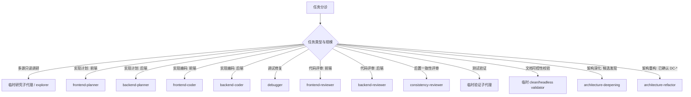

## 子代理委派

- 子代理只在三类收益明确时使用：隔离大量中间上下文、并行处理相互独立且写入不重叠的任务、或需要独立复核以避免自评。
- 单一文件、单条短命令、范围明确的小改、共享状态或强耦合同一文件改动，由主代理直接完成，并在交付中说明未委派原因。
- 并行委派前必须确认无先后依赖、无共享写入范围且可独立验证；存在依赖但上下文冗长时，由主代理串行委派并逐个验收。

## 关键环节子代理调度索引（什么时候调用什么子代理）

- `skill` 决定知识内容和方法论，`subagent` 决定上下文隔离、并行和反自评边界；不得因为“角色特点不同”就自动拆 agent。
- 每次委派必须给子代理自包含输入：目标、相关路径、约束、禁止事项、期望回传格式和验证方式。
- 子代理回传是自述，不是事实；主代理必须用文件、diff、命令输出、日志或 URL 复核后才能对外声明通过。
- reviewer 必须与 coder 是不同实例；拆出独立 agent 必须命中隔离、并行或独立性之一。
- `consistency-reviewer` 在编码后、测试验证前评估最终 diff 是否符合需求、用例、实现计划或 bugfix 诊断；不得替代编码前 `consistency-check`，纯文档/注释/格式或无行为配置改动才可标 `N/A`，缺少可核对上游时标 `MISSING blocked`。
- bugfix 在根因不明且日志/复现量大时可先派 `debugger` 只读诊断；根因明确的小 bug 不强制委派。
- 架构深化先由 `architecture-deepening` 发现候选；只有用户确认具体 DC-* 后，才由 `architecture-refactor` 落地等价重构。
- headless / 干净隔离用于文档可控性校验；无法提供时标记 `MISSING` 或 `NOT RUN`，不得由主上下文自评为 `PASS`。
- 干净隔离指无主会话历史、无宿主 AGENTS/baseline、无额外引导；可使用只读工具、文件系统快照和显式注入的必要规则/产物/rubric。
