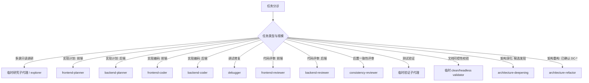

## 子代理委派

- 先按流程图选择环节；单文件、短命令、强耦合小改由主代理直接做，并说明未委派原因。
- 只有命中隔离、并行或独立复核收益时才拆子代理；并行前确认无依赖、无共享写入范围且可独立验证。

## 关键环节子代理调度索引（什么时候调用什么子代理）

图例 / 硬约束：

- 图中具名 agent 是默认调度入口；宿主不支持同名 agent 时，用同职责、同隔离边界的可用子代理。
- `skill` 决定方法论，`subagent` 决定隔离、并行和反自评边界；不得只因角色名不同拆 agent。
- 每次委派必须自包含；子代理回传必须由主代理用文件、diff、命令输出、日志或 URL 复核。
- reviewer 必须与 coder 是不同实例；拆 agent 必须命中隔离、并行或独立性之一。
- 实现性改动后默认在编码后、测试验证前走 `consistency-reviewer` 核对最终 diff；不得替代编码前 `consistency-check`。纯文档、纯注释、纯格式或无行为配置改动可标 `N/A`；缺少可核对上游时标 `MISSING blocked`。
- clean/headless validator 指干净隔离：无主会话历史、无宿主 AGENTS/baseline、无额外引导；无法提供时标 `MISSING` 或 `NOT RUN`，不得由主上下文自评为 `PASS`。
