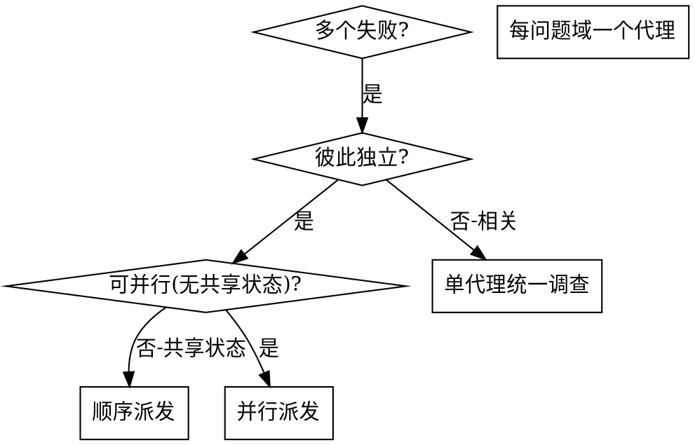

# 并行派发子代理

面对 2 个以上彼此独立、无共享状态、无顺序依赖的任务时，并行派发子代理，让它们并发推进。本 skill 由编排或用户按名调用，不在普通对话自动触发。

子代理拿到的是你精心构造的、自包含的隔离上下文，不继承你的会话历史；这既保证它们聚焦，也保住你自己的协调上下文。

核心原则：每个独立问题域派一个子代理，让它们并发工作。

## 触发条件

并行派发的前提是同时命中"无依赖 / 无共享写入 / 可独立验证"——这也是本仓拆 agent 必须命中"并行/独立性"判据的体现。典型场景：

- 3 个以上测试文件因不同根因失败。
- 多个子系统各自独立损坏。
- 每个问题都能脱离其它问题单独理解。
- 各调查之间无共享状态。

## 不适合场景

- 失败相关（修一个可能修好其它）：先合并调查，不要拆。
- 需要完整系统状态才能理解。
- 还不知道坏在哪的探索性调试。
- 多个子代理会写同一批文件/抢同一资源（共享写入范围）：会互相干扰，不可并行。

## 派发模式

### 1. 识别独立问题域

按"坏了什么"分组，确认每组互不影响（修 A 不影响 B）。

### 2. 构造聚焦的子代理任务

每个子代理拿到：

- 明确范围：一个测试文件或子系统。
- 明确目标：让这些测试通过。
- 约束：不要改其它代码。
- 期望输出：发现了什么、修了什么的回传摘要。

每次委派必须自包含，不灌主会话历史。

### 3. 并行派发

在同一条回复里发出全部派发调用 = 并发执行；一条回复一个 = 顺序执行。

### 4. 复核与整合

子代理回传后，由主代理复核：

- 读每份摘要。
- 检查改动是否冲突（是否动了同一处代码）。
- 跑全量测试，确认所有改动协同工作。
- 抽查：子代理可能犯系统性错误。

回传必须由主代理用 diff、命令输出、日志复核，不得直接采信。

## 子代理 prompt 结构

好的派发 prompt 应当：

1. 聚焦：一个清晰问题域。
2. 自包含：理解该问题所需的全部上下文（贴上错误信息、测试名）。
3. 明确输出：要求子代理回传什么。

常见错误对照：

| 错误 | 修正 |
|------|------|
| 太宽泛（"修所有测试"） | 指定具体文件/范围 |
| 无上下文（"修那个竞态"） | 贴错误信息与测试名 |
| 无约束（可能大改特改） | "不要改生产代码 / 只改测试" |
| 输出含糊（"修好它"） | "回传根因与改动摘要" |

## 输出边界

- 本 skill 只负责"判断可否并行 + 如何派发 + 整合"，不替代子代理内部的实现/调试方法论。
- 并行前必须确认无依赖、无共享写入范围、可独立验证；任一不满足就退回顺序派发。
- 整合后跑全量测试，验证状态只用 `PASS` / `FAIL` / `MISSING` / `NOT RUN` / `N/A`，不得把未跑或冲突写成通过。
- 子代理回传一律视为待复核数据，由主代理用可核对证据确认后再整合。
