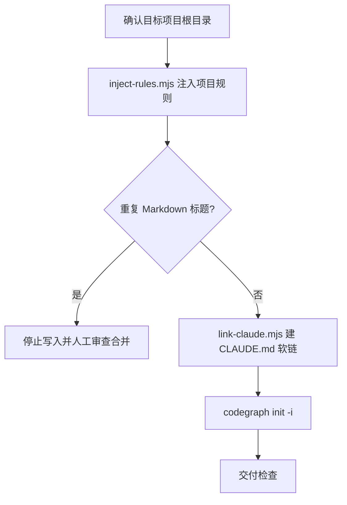

# Init Project

最小化项目初始化：注入项目规则、建立 `CLAUDE.md` 软链、初始化 CodeGraph。

## 触发条件

- 用户创建新项目、初始化项目，或首次为已有项目接入 AIRules。
- 需要生成/补充项目根 `AGENTS.md`、建立 `CLAUDE.md` 链接或初始化 CodeGraph。

## 不适合场景

- 项目已完成初始化，用户只要求普通业务代码、文档或单个 skill 修改。
- 目标目录或写入权限无法确认时，不猜测、不覆盖用户文件。

## 输出边界

- 只改初始化交付物：项目根 `AGENTS.md`、`CLAUDE.md` 链接、CodeGraph 初始化结果。
- 不改依赖目录、构建产物、vendor、宿主目录或用户未授权文件。
- `references/**` 只承载注入到用户项目的项目级规则；不写入 AIRules 维护者规则（变更分级、子代理调度、host 投影、发布流程等归 AIRules 仓库自身）。

## 初始化流程

| 环节 | 命令 | 关键输出 | 失败语义 |
|---|---|---|---|
| 规则注入 | `node <init-project-skill>/scripts/inject-rules.mjs <project>` | 项目根 `AGENTS.md`（airules-base + code-core） | 重复标题必须人工审查合并，不自动跳过 |
| Claude 链接 | `node <init-project-skill>/scripts/link-claude.mjs <project>` | `CLAUDE.md` 软链指向 `AGENTS.md` | 非托管文件或链接到其它目标时停止 |
| CodeGraph | 在项目根执行 `codegraph init -i` | `.codegraph` 初始化状态 | 命令缺失报 `MISSING` |

- `<init-project-skill>` 占位符由脚本运行时解析为真实 init-project skill 根目录；下游不得残留字面量。
- `inject-rules.mjs` 自动处理 `airules-base.md`（仅在 `AGENTS.md` 为空/新建时注入）与 `code-core.md`；命令无需手动传 reference。

## 交付检查

| 检查项 | 期望 |
|---|---|
| 规则 | 项目根 `AGENTS.md` 含项目规范骨架与代码核心纪律 |
| `CLAUDE.md` | 软链接指向 `AGENTS.md`；Windows 无符号链接权限时回退为同一文件实体硬链接，并在日志说明 |
| CodeGraph | `codegraph init -i` 真实执行并报告 `PASS`、`FAIL`、`MISSING` 或 `NOT RUN` |
