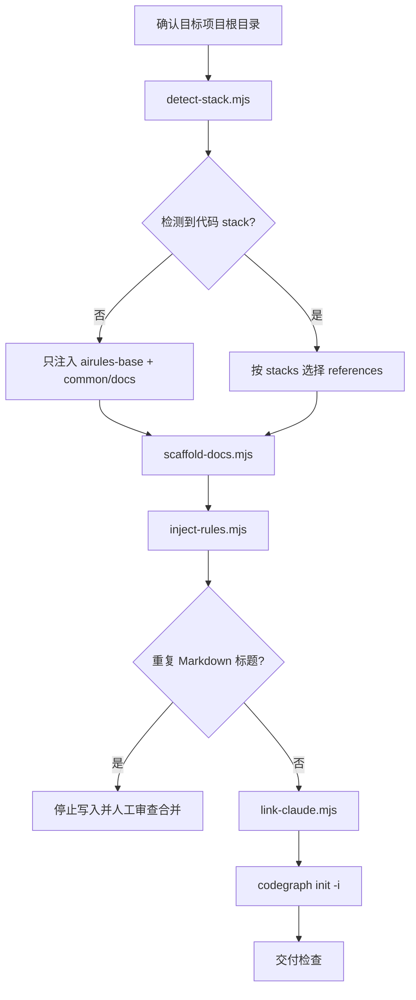
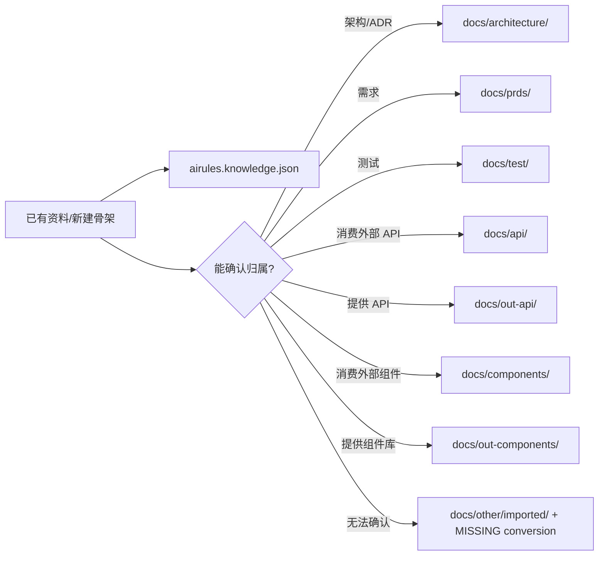
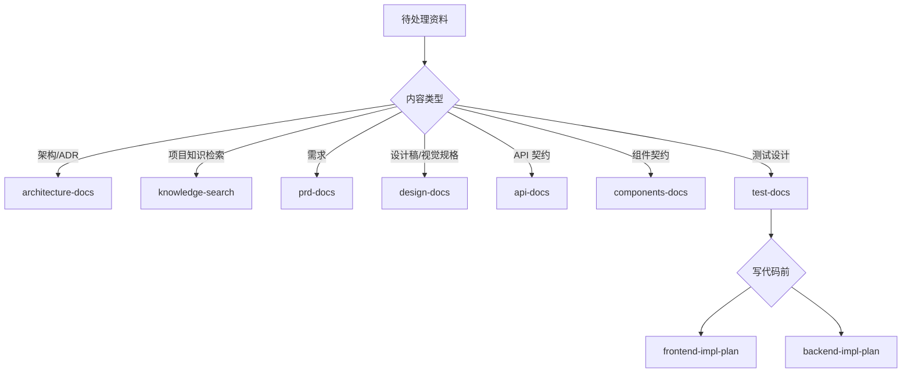
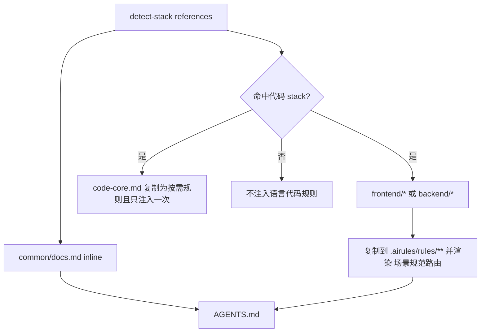

# Init Project

## 触发条件

- 用户创建新项目、初始化项目，或首次为已有项目接入 AIRules。
- 需要生成项目根 `AGENTS.md`/`CLAUDE.md`、创建 docs 骨架、登记 `airules.knowledge.json` 或初始化 CodeGraph。

## 不适合场景

- 项目已完成初始化，且用户只要求普通业务代码、普通文档或单个 skill 修改。
- 目标目录、技术栈或写入权限无法确认时，不猜测、不覆盖用户文件。

## 输出边界

- 只改初始化交付物：`AGENTS.md`、`CLAUDE.md`、`airules.knowledge.json`、`docs/**`、`.airules/rules/**` 和 CodeGraph 初始化结果。
- 不改依赖目录、构建产物、vendor、宿主目录或用户未授权文件。
- `skills/init-project/references/**` 禁止写入 AIRules 维护者规则；变更分级、澄清门禁、子代理委派、开发流程控制和后置评审归宿主全局 `rules/AGENTS.md`。

## 初始化总流程

| 环节 | 命令 | 关键输出 | 失败语义 |
|---|---|---|---|
| 技术栈检测 | `node <init-project-skill>/scripts/detect-stack.mjs <project>` | `stacks`、`references`、`projects`、`evidence` | 空 `stacks` 只走通用基线 |
| 文档骨架 | `node <init-project-skill>/scripts/scaffold-docs.mjs <project> <stack...>` | `airules.knowledge.json`、标准 `docs/` | 冲突或归档目标已存在时停止 |
| 规则注入 | `node <init-project-skill>/scripts/inject-rules.mjs <project> <reference...>` | `AGENTS.md`、`.airules/rules/**` | 重复标题必须审查，不自动跳过 |
| Claude 链接 | `node <init-project-skill>/scripts/link-claude.mjs <project>` | `CLAUDE.md` 指向 `AGENTS.md` | 非托管文件/错误链接时停止 |
| CodeGraph | 在项目根执行 `codegraph init -i` | `.codegraph` 初始化状态 | 命令缺失报 `MISSING` |

## 文档归属图

| 目录 | 用途 | 创建条件 |
|---|---|---|
| `docs/architecture/` | 架构事实、模块边界、ADR | 所有项目 |
| `docs/api/` | 当前项目消费的外部 API/SDK 契约 | 所有项目 |
| `docs/prds/`、`docs/test/`、`docs/other/`、`docs/map.md` | 需求、测试、未归类资料、文档导航 | 所有项目 |
| `docs/components/` | 当前项目消费的外部组件库/Design System | `component-consumer` |
| `docs/design/` | 设计稿转写的视觉事实源 | UI stack |
| `docs/out-api/`、`docs/out-components/` | 当前项目对外提供的 API/组件契约 | 由 `api-docs` / `components-docs` 生成，不由 scaffold 默认创建 |

## 文档 Skill 路由

- `frontend-impl-plan` 只写前端方案：需求来源、组件使用/封装、布局、状态、API 调用。
- `backend-impl-plan` 只写后端方案：需求来源、接口设计、数据模型、分层、事务一致性。
- 标准化旧文档时先用 `knowledge-search` 定位证据；无法确认 ownership 时标 `MISSING ownership` 或 `MISSING conversion`。

## 规则注入图

| `detect-stack` stack | 追加 references |
|---|---|
| `frontend` | `code-core.md`、`frontend/code.md` |
| `component-library` | `code-core.md`、`frontend/out-components.md` |
| `component-consumer` | `code-core.md`、`frontend/components.md` |
| `vue` | `code-core.md`、`frontend/vue.md` |
| `node` | `code-core.md`、`backend/code.md`、`backend/out-api.md`、`backend/api-consumer.md`、`backend/node.md` |
| `nestjs` | `code-core.md`、`backend/code.md`、`backend/out-api.md`、`backend/api-consumer.md`、`backend/nestjs.md` |
| `java` | `code-core.md`、`backend/code.md`、`backend/out-api.md`、`backend/api-consumer.md`、`backend/java.md` |

- `inject-rules.mjs` 自动处理 `airules-base.md`（仅新建/空 `AGENTS.md`）与 `common/docs.md`；命令里不用手动重复传入。
- 无 frontmatter 的 reference inline 到 `AGENTS.md`；带 `ruleScope` 的 reference 复制到 `.airules/rules/**`，并只在 `AGENTS.md` 渲染《场景规范路由》。
- `<init-project-skill>` 占位符由注入脚本替换为真实 init-project skill 根目录；下游不得残留字面量 `<init-project-skill>`。

## 交付检查

| 检查项 | 期望 |
|---|---|
| 技术栈 | 报告 `detect-stack` 的 `stacks`、`references`、关键 `evidence` |
| 规则 | `AGENTS.md` 含通用项目规则；语言/框架规则按路由进入 `.airules/rules/**` |
| 知识源 | `airules.knowledge.json` 存在，并通过 `node <init-project-skill>/scripts/verify-knowledge-sources.mjs airules.knowledge.json` |
| 文档 | `docs/map.md`、`docs/architecture/`、`docs/api/_protocol.md`、`docs/prds/`、`docs/test/`、`docs/other/` 存在；可选目录按 stack 创建 |
| 旧文档 | 已确认归属并进入标准目录；无法确认的在 `docs/other/imported/` 标 `MISSING conversion` |
| `CLAUDE.md` | 指向 `AGENTS.md` 的软链接；Windows 无权限时可为同一文件实体硬链接且日志说明 |
| CodeGraph | `codegraph init -i` 真实执行并报告 `PASS`、`FAIL`、`MISSING` 或 `NOT RUN` |
