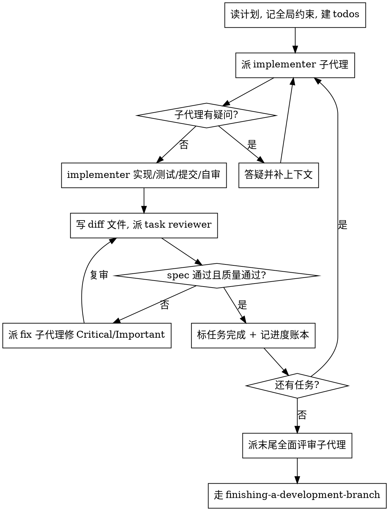

# 子代理驱动开发

在当前会话内执行实现计划：每个任务派一个全新 implementer 子代理，任务后做任务级评审（spec 合规 + 代码质量），整支分支末尾再做一次全面评审。本 skill 由编排或用户按名调用，不在普通对话自动触发。

为什么用子代理：你把任务委派给上下文隔离的子代理，靠精确构造它们的指令与上下文让它们聚焦并成功；它们不继承你的会话历史——你只构造它们真正需要的。这也保住你自己的协调上下文。

核心原则：每任务一个全新子代理 + 任务级评审（spec + 质量）+ 末尾全面评审 = 高质量、快迭代。

对齐本仓协议：implementer 对应 `coder`，reviewer 对应 `code-reviewer`/`*-reviewer`；reviewer 必须与编写该代码的 coder 是不同实例，不得自评；每次委派自包含，回传由主代理用 diff/命令输出/日志复核。

## 触发条件

- 已有实现计划（通常 `writing-plans` 产出），任务之间大体独立。
- 想在当前会话内连续执行、不在任务间反复打断用户。
- 宿主支持派发子代理。

## 不适合场景

- 没有计划：先 `writing-plans` 或先头脑风暴，不要边想边写。
- 任务紧耦合：拆子代理收益不足，手工顺序执行即可。
- 需要切换到独立并行会话：用 `executing-plans`。
- 拆 agent 未命中"隔离/并行/独立性"任一判据：不要只因角色名不同就拆。

## 执行流程

连续执行：任务之间不要停下来跟用户确认。除非遇到无法解决的 BLOCKED、真正阻碍推进的歧义、或全部完成，否则一路执行——用户让你执行计划，就执行。

## 派发前预检

派第 1 个任务前，把计划通读一遍找冲突：互相矛盾的任务、与全局约束冲突的任务、计划强制但评审规则会判为缺陷的写法（断言空洞的测试、整块逻辑逐字重复）。把发现的项连同对应计划原文一次性批量呈给用户问"以哪个为准"，不要边执行边逐个打断。扫描干净就直接开始。歧义才澄清，不要一遇模糊就升级阻断。

## 模型选择

在能胜任的前提下，每个角色用尽量便宜的模型以省成本提速。派子代理时总是显式指定模型——省略会继承会话默认（往往最贵）。

- 机械实现（孤立函数、规格清晰、1-2 文件）：便宜模型；计划已含完整代码=转写+测试，用最便宜档。
- 集成/判断（多文件协调、调试）：标准模型。
- 架构/设计、以及末尾全面评审：最强模型。
- 评审：按 diff 规模/复杂度/风险匹配，便宜档作为评审者下限。
- 周转轮数比单价更重要：最便宜模型在多步任务上常多花 2-3 倍轮数，反而更贵。

## 处理 implementer 状态

implementer 回传四种状态之一：

- DONE：生成评审包（对你记录的 BASE 到 HEAD 跑 diff，BASE 是派 implementer 前记下的提交，绝不用 `HEAD~1`——会丢掉多提交任务里除最后一个外的全部），把路径交给 task reviewer。
- DONE_WITH_CONCERNS：先读疑虑；涉及正确性/范围的先处理再评审，纯观察记录后继续。
- NEEDS_CONTEXT：补缺失上下文后重派。
- BLOCKED：评估阻塞——上下文问题就补后同模型重派；需更多推理就换更强模型；任务过大就拆小；计划本身错就上报用户。绝不忽略上报、也不让同一模型无变化重试。

## 评审与 ⚠️ 项

task reviewer 给两个结论：spec 合规与代码质量，缺任一不算完成。它可能回"⚠️ 无法从 diff 核实"的项（涉及未改代码或跨任务）——这些不阻塞其余评审，但你必须逐个自行核实（你握有计划与跨任务上下文）；确认是真缺口就当 spec 评审失败，退回 implementer 并复审。

## 构造评审者 prompt

任务级评审是任务范围的门禁，全面评审只在末尾一次。填评审模板时：

- 不加"检查所有用法""有空跑竞态测试"这类无具体理由的开放指令。
- 不让评审者重跑 implementer 已在同一代码上跑过的测试（其报告已带测试证据）。
- 不替评审者预判结论——绝不指示评审者"忽略/不要标记某问题"或预设严重级别（"最多算 Minor""计划已选 X"）。若你认为某发现是误报，让评审者提出、你在评审环中裁决。
- 交给评审者的全局约束块是它的注意力镜头：从计划的全局约束或规格里逐字拷贝绑定要求（精确值、精确格式、组件间关系），过程规则（YAGNI、测试卫生、评审方法）模板已自带。
- diff 以文件形式交付：生成评审包后把路径写进 prompt，输出不进你自己的上下文，评审者一次 Read 就看到提交列表、stat、带上下文的完整 diff。
- 一条派发 prompt 只描述一个任务，不贴会话历史与往期任务摘要——全新子代理只要它的任务、它触及的接口、全局约束。
- Critical/Important 派 fix 子代理修；Minor 记进度账本，末尾全面评审据此分诊。
- 标为"计划强制"或与计划文本冲突的发现，是用户的决定：呈上发现与计划原文问以哪个为准，不擅自按违背计划的方向修。
- 每个 fix 派发都带 implementer 契约：fix 子代理重跑覆盖其改动的测试并回传结果（命名覆盖测试文件，一行修复不必跑全套）；复审前确认 fix 报告含覆盖测试、所跑命令、输出三者齐全。
- 末尾全面评审若返回多个发现，派**一个** fix 子代理带完整清单，不要每发现一个 fixer（各自重建上下文、重跑套件，代价极高）。

## 文件交接

凡贴进派发 prompt 或子代理回传的内容都会常驻你的上下文、每轮重读。用文件交接：

- 任务简报：派 implementer 前把该任务全文抽到唯一命名文件，prompt 里引"先读这个，它是你的需求与要逐字采用的精确值"。精确值（数字、魔法串、签名、用例）只出现在简报里。
- 报告文件：报告文件名跟随简报名，implementer 把完整报告写进去，只回传状态、提交、一行测试摘要、疑虑。
- 评审者输入：task reviewer 拿三个路径——同一简报、报告文件、评审包——外加绑定该任务的全局约束。

## 持久进度

会话记忆扛不过 compaction。用账本文件而非仅 todos 记进度：

- 起步时检查账本（项目根下的隔离 scratch 目录，git-ignored）；标为完成的任务即 DONE，不要重派，从首个未完成任务续。
- 某任务评审干净后，在做其它记账的同一条消息里追加一行：`Task N: complete (commits <base7>..<head7>, review clean)`。
- 账本是恢复地图：它命名的提交在 git 里真实存在，compaction 后信账本与 `git log` 而非记忆。`git clean -fdx` 会毁账本，被毁则从 `git log` 恢复。

## 输出边界

- implementer/reviewer/fixer 均为隔离子代理；reviewer 必须 ≠ 编写该代码的 coder 实例，不得自评。
- 每次委派自包含，不灌主会话历史；回传一律视为待复核数据，由主代理用 diff/命令输出/日志核实。
- 验证状态只用 `PASS` / `FAIL` / `MISSING` / `NOT RUN` / `N/A`，spec 合规与代码质量缺任一不算完成。
- 未经用户明确同意不在 main/master 上开始实现；末尾走 `finishing-a-development-branch` 收尾。

## 配套 skill

- `using-git-worktrees`：确保隔离工作区。
- `writing-plans`：产出本 skill 执行的计划。
- `requesting-code-review`：末尾全面评审的评审方法论。
- `dispatching-parallel-agents`：独立任务可并行派发时的补充。
- `finishing-a-development-branch`：全部任务后的收尾。
- 子代理实现单个任务时遵循 `test-driven-development`。
